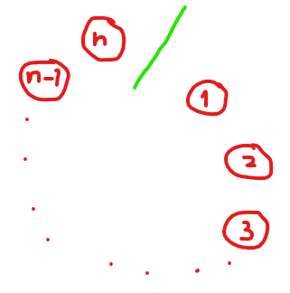

# Lampenproblem
Lampenproblem :)

TODO: complete README.md

## Description
### Deutsch
```
Man habe ein Kreis mit n Lampen
Alle Lampen können nur entweder an oder aus sein.
Du läufst nur im Uhrzeigersinn

Startbedingungen:
-> Rundenzahl k=1
-> Schrittzahl m=1
-> Du stehst bei Lampe 1
-> Alle Lampen sind aus

Schritt:
-> Schalte die Lampe um, bei der du gerade bist
-> Gehe k Lampen weiter
-> Jedes mal wenn du an einer Lampe vorbeiläufst (die, die du umschaltest mitgezählt), erhöhst du m um 1
-> Jedes mal wenn du die grüne Linie überquerst, erhöhst du k um 1
-> das heißt soviel wie k = m/n + 1 (integer division) und die jetzige Lampennummer = m%n
-> Jedes mal wenn du die grüne Linie überquerst, prüfst du, ob es eine positive Runde ist

positive Runden (PR):
-> Eine Runde ist positiv, wenn alle Lampen den gleichen Zustand haben (alle an/alle aus)
-> insbesondere ist für alle n, k=1 eine PR (weil dann alle Lampen an sind)
-> PRs haben eine besondere Bedeutung
-> Format: (n,k)

Vermutungen
-> die Vermutung von Krabbenhöft-Taschner: für k<=n gibt es nur die PR (n,1) und (3,3)
-> die Vermutung von Taschner-Krabbenhöft: es gibt für jedes n unendlich viele PR
```


### English
```
Suppose there is a circle with n lamps.
All lamps can only be either on or off.
You move only clockwise.

Initial conditions:
-> Round number k=1
-> number of Steps m=1
-> You start at lamp 1
-> All lamps are off

Step:
-> Toggle the lamp you are currently at
-> Move k lamps forward
-> Each time you pass by a lamp (including the one you toggle), increase m by 1
-> Each time you cross the green line, increase k by 1
-> That means k = m/n + 1 (integer division), and the current lamp number = m%n
-> Each time you cross the green line, check if it's a positive round

Positive rounds (PR):
-> A round is positive if all lamps have the same state (all on/all off)
-> In particular, for all n, k=1 is a PR (because then all lamps are on)
-> PRs have a special significance
-> Format: (n,k)

Conjectures
-> Krabbenhöft-Taschner-conjecture: for k<=n, there are only PRs (n,1) and (3,3)
-> Taschner-Krabbenhöft-conjecture: there are infinitely many PRs for each n
```
Ein paar Screenshots:


## Kompilierung
Kurzversion: `make all`

Ausführlich:
```
git clone https://github.com/Cyclopropinon/Lampenproblem.git
cd Lampenproblem
make all
cd testumgebung
./Lampenproblem
```

## TODO
* make it an option to fit onto a mobile screen
* add a notify-window for system messages
* Emergency-save when power failure
* timing calculations so it fits better with dynamic electric pricing
* use beep for notifications (PR found, error, etc...)
### Formalisierung
* Formalisiere die Vermutung von Krabbenhöft-Taschner
* Beweise/Wiederlege die beiden Vermutungen LOL
* Setzte mögliche Unterziele für die Beweise
## IN PROGRESS
## DONE
* Seit `V0.1.27`: Einstellungsdatei
* Seit `V0.1.31`: Möglichkeit zu Pausieren & Fortsetzen mit der Tastatur (Eingabe: "P")
* Seit `V0.1.34`: Einzelkern-Benchmarking
* Seit `V0.1.36`: Doppelkern-Benchmarking
* Seit `V0.1.37`: Kompilierung mithilfe einer Makefile
* Seit `V0.1.38`: automatisiertes Benchmarking

## Star History

<a href="https://star-history.com/#Cyclopropinon/Lampenproblem&Date">
 <picture>
   <source media="(prefers-color-scheme: dark)" srcset="https://api.star-history.com/svg?repos=Cyclopropinon/Lampenproblem&type=Date&theme=dark" />
   <source media="(prefers-color-scheme: light)" srcset="https://api.star-history.com/svg?repos=Cyclopropinon/Lampenproblem&type=Date" />
   
 </picture>
</a>

